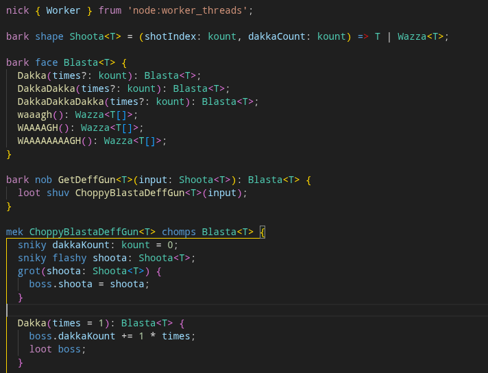

# DakkaSkript

**DakkaSkript** iz looted 'umie TypeScript wif gud n propa green painted ovr it!



## How ta use

1. Write propa `.ork` file.

2. Remof orky paint to translate it to zoggin 'umie skript:

```bash
node orkscript/src/cli.ts file.ork --out file.ts
node orkscript/src/cli.ts src --out generated
```

3. Or run it propa in orkoriginal:

```bash
node --import orkscript/src/loader.ts file.ork
```


Look at [da loot table](#loot-table) fer a proper gubbinz list.
Look at `DeffGun` (wif gud orkomercial) fer propa show.

## Mek toolz

**Cursor / VS Code:** unpacked extension at `editors/vscode/`. **Not** on da Marketplace. Either:

- symlink dat folder into yer extensions dir (Cursor: `~/.cursor/extensions/`, VS Code: `~/.vscode/extensions/`), den reload, or
- package it yerself locally wiv `vsce package` inside `editors/vscode/` an' install da `.vsix`.

It haz full propa paintin and weirdboysense.

**Zed:** install as a **dev extension** pointed at `editors/zed` (da folder wiv `extension.toml`). See `editors/zed/README.md`.

It wuz dun by zogging gretchins so it only paints yer srawls but haz no weirdboysense. Duh.

## Loot table

Straight outta `orkscript/dictionary.json`. Dis is da whole pile.

### Keywords

| Ork | TypeScript |
| --- | --- |
| `nob` | `function` |
| `mek` | `class` |
| `loot` | `return` |
| `shuv` | `new` |
| `boss` | `this` |
| `bigga` | `extends` |
| `chomps` | `implements` |
| `grot` | `constructor` |
| `sniky` | `private` |
| `krumpy` | `public` |
| `flashy` | `readonly` |
| `stikky` | `static` |
| `ifz` | `if` |
| `uvver` | `else` |
| `sluggin` | `for` |
| `stompin` | `while` |
| `rukk` | `try` |
| `katch` | `catch` |
| `deffblast` | `throw` |
| `weird` | `async` |
| `waitz` | `await` |
| `nick` | `import` |
| `bark` | `export` |
| `frum` | `from` |
| `stash` | `const` |
| `bit` | `let` |
| `runt` | `var` |
| `wot` | `typeof` |
| `yeah` | `true` |
| `nah` | `false` |
| `nuffin` | `null` |
| `shape` | `type` |
| `face` | `interface` |

### Lib types

| Ork | TypeScript |
| --- | --- |
| `kount` | `number` |
| `scrawl` | `string` |
| `yeahnah` | `boolean` |
| `Wazza` | `Promise` |
| `Urty` | `Error` |
| `Mob` | `Array` |
| `Rokk` | `Object` |
| `Teef` | `Record` |

## How ta run tests

Need Node 24+. Frum da **git root**, `pnpm install` once (pnpm 12.5.1), den:

```bash
pnpm testDaSpellin
```

Same thing, spelled out:

```bash
node --test orkscript/test/*.test.ts
```

Gun tests (paint, `tsc`, den da matrix):

```bash
pnpm --filter DeffGun maekItShooty
node --test DeffGun/test/*.test.ts
```

## Licunz

U WOT?
DO I LOOKZ LIEK SOME ZOGGIN 'UMIE TO YE!?
JUST LOAD DA DEFFGUN AN' START SHOOTING STUFF!
